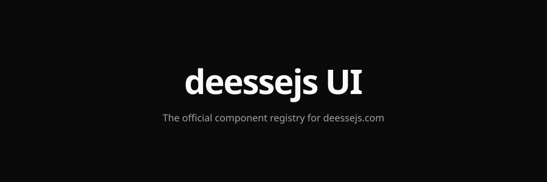

<p align="center">
  <picture>
    <source media="(prefers-color-scheme: dark)" srcset="public/banner-ds.jpg">
    <source media="(prefers-color-scheme: light)" srcset="public/banner-ds.jpg">
    
  </picture>
</p>

<h1 align="center">DeesseJS UI</h1>

<p align="center">
  <strong>The official component registry for DeesseJS.com.</strong>
  Real components, live preview, source shown verbatim.
</p>

<p align="center">
  <a href="https://github.com/deessejs/ui/blob/main/LICENSE">
    
  </a>
  <a href="https://github.com/deessejs/ui/actions/workflows/ci.yml">
    
  </a>
  <a href="https://github.com/deessejs/ui/stargazers">
    
  </a>
</p>

<p align="center">
  <a href="https://ui.deessejs.com">View live site →</a>
  &nbsp;&nbsp;&nbsp;
  <a href="https://github.com/deessejs/ui">Browse source →</a>
</p>

---

## What's in this repo

| Path | Role | Notes |
|---|---|---|
| `apps/web/` | Showcase site | Next.js 16, deployed at `ui.deessejs.com` |
| `packages/registry/` | Component library | Real `.tsx` components, each with `index.tsx` + `meta.ts` |
| `packages/ui/` | shadcn primitives | Base UI (not Radix) + Tailwind v4 tokens |
| `learnings/` | Design research | The anti-slop thesis behind the design system |

## Why this registry

- **Real components, not wrappers.** Each component lives as a real `.tsx` file. The registry ships actual code you can copy.
- **Source shown verbatim.** The "Code" tab on every detail page is the real file content, extracted via `fs.readFileSync` — not generated stubs.
- **Live preview, not screenshots.** Each component renders in the page, so you see what it actually does, not a mock.
- **Themable by tokens.** Every color, every gap follows the design system. No raw palette utilities escape into the registry.
- **Designed for AI agents.** Components are real, discoverable, and copyable — no abstractions to fight through.

## Adding a component

1. Create `packages/registry/src/components/<id>/` with two files:
   - `index.tsx` — exports the component plus a `Demo` function
   - `meta.ts` — `ComponentMeta { id, name, description, category, variants? }`
2. Register in `apps/web/lib/registry/`:
   - Import the component and `Demo` in `index.ts`
   - Add the `fs.readFileSync` source in `sources.ts`
   - Append to `COMPONENT_REGISTRY`
3. Run `npm run typecheck` to confirm the build still passes.
4. Push. The registry re-deploys with the new component on the next Vercel build.

> [!TIP]
> The `Demo` export renders the component in the preview tab. Keep it self-contained — no external state, no providers.

## Project structure

```
.
├── apps/
│   └── web/                Next.js 16 showcase site
├── packages/
│   ├── registry/           @workspace/registry — the deessejs component library
│   │   └── src/components/  One folder per component (index.tsx + meta.ts)
│   ├── ui/                 @workspace/ui — shadcn primitives (Base UI)
│   ├── eslint-config/      Shared ESLint config
│   └── typescript-config/  Shared TypeScript configs
├── docs/
│   ├── product/            This README lives here
│   └── learnings/          Design research (anti-slop thesis)
├── turbo.json              Monorepo task graph
└── package.json            Workspaces: apps/*, packages/*
```

## Architecture notes

- **shadcn on Base UI, not Radix.** We import from `@workspace/ui/components/*` which uses `@base-ui/react/*` primitives. All shadcn components (Tabs, Breadcrumb, Empty, etc.) follow this.
- **Source extraction via `fs.readFileSync`.** The `Code` tab pulls content from `packages/registry/src/**/*.tsx` at module load. Earlier attempts with `?raw` imports failed in the Next.js + Turbopack + workspaces context.
- **Dual-theme syntax highlighting.** Shiki emits `--shiki-light` and `--shiki-dark` CSS variables per token. `globals.css` switches based on the `.dark` class. Zero client JS for theme switching.
- **Registry seam for the future DB.** `apps/web/lib/registry/index.ts` is the single entry point. When components move to a database, only this file changes — pages don't.

## Contributing

Open an issue to discuss larger changes. For typos, broken links, and small fixes, PRs are welcome.

## License

[MIT](./LICENSE). See the LICENSE file for details.

## Support

- Issues: [github.com/deessejs/ui/issues](https://github.com/deessejs/ui/issues)
- Discussions: [github.com/deessejs/ui/discussions](https://github.com/deessejs/ui/discussions)
- Email: [support@deessejs.com](mailto:support@deessejs.com)